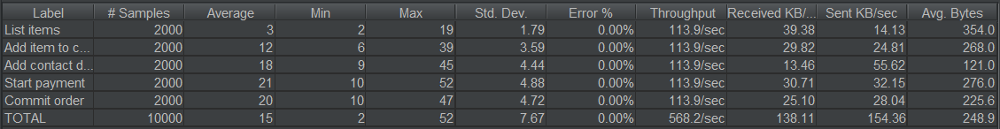

# Spring Boot vs Quarkus
In the Java world we were having different kind of tools/frameworks for enterprise solutions. We have the Java EE specification which describes different kinds of specifications for different use cases and these specs are having different kind of implementations by different vendors.  

As we all know in the past (and some people say that in the present) it had some problems/difficulties. As a developer if we hear the term Java EE we immediately think about a heavy application server which consumes a lot of memory, projects with an infinite amount of maven modules, big .war or .ear files, lot of configuration files, JNDI resources, freezing IDEs and very long coffee breaks because of the long running build times and deployment times in local environments.

Does it sound familiar? Kinda.

The world and especially the Java ecosystem changed a lot when Spring were revealed and almost made an industry standard in the Java EE world, but Spring is not a Java EE compliant implementation of the specification, but throught the years they both the Spring ecosystem and the Java EE specs were evoling together, sharing ideas and implementing them in similar ways.  

Today we are not here to discuss the **Java EE** vs **Spring** war, rather than start a discussion about a Java EE successor,
which tries to overtake the Java EE world with its lightweight implementations and by trying to use Java EE spec implementations like CDI, JPA, JAX-RS, and they are saying that they made the framework container first which may sounds really cool in a world where containers are everywhere.

## This is [Quarkus](https://quarkus.io)

In this article we are going to compare Spring Boot and Quarkus performance with different optimizations and tuning.  
    
There is a project written in both Spring and Quarkus way, a really simple e-commerce framework implementation, which supports basic product listing, cart functions (adding items to cart), saving contact details about the order, starting order and then finalizing/committing order.  
  
**PostgreSQL 12.1** will be used for persistence with the default configuration, and the application will have **create-drop** schema generation strategy!

---

### Quarkus setup: 
 
 - 1.9.2.Final
 - ArC
 - JAX-RS
 - Hibernate Panache
 
### Spring Boot setup:

  - 2.4.0
  - Spring DI
  - Spring WebMVC
  - Spring Data JPA
  
---

The cases will go with the following setups:  

  1. Both frameworks have some built in Docker image support, the first case will be using the default configurations for Dockerfile and for their application properties thread pool size will be 200 and the datasource pool size will be 20:
     * 10 thread 200 times - 3 runs
     * Quarkus: 
       * `quarkus.thread-pool.max-threads=200`
       * `quarkus.datasource.jdbc.max-size=20`
     * Spring Boot:
       * `server.tomcat.threads.max=200`
       * `spring.datasource.hikari.maximum-pool-size=20`
  2. Changing datasource pool sizes to 50:
     * 10 threads 200 times - 3 runs
     * Quarkus:
       * `quarkus.thread-pool.max-threads=200`
       * `quarkus.datasource.jdbc.max-size=50`
     * Spring Boot:
       * `server.tomcat.threads.max=200`
       * `spring.datasource.hikari.maximum-pool-size=50`
  3. Changing the thread pool sizes to 300 and keep the datasource pool size at 50
     * 300 threads 100 times - 2 runs
     * Quarkus:
       * `quarkus.thread-pool.max-threads=300`
       * `quarkus.datasource.jdbc.max-size=50`
     * Spring Boot:
       * `server.tomcat.threads.max=300`
       * `spring.datasource.hikari.maximum-pool-size=50`
  4. Changing the JDK to an [OpenJ9](https://www.eclipse.org/openj9/) **(adoptopenjdk:11.0.9_11-jre-openj9-0.23.0)** based one and keeping the thread pool size at 300 and datasource pool size at 50:
     * 300 threads 100 times - 2 runs
     * Quarkus:
       * `quarkus.thread-pool.max-threads=300`
       * `quarkus.datasource.jdbc.max-size=50`
     * Spring Boot:
       * `server.tomcat.threads.max=300`
       * `spring.datasource.hikari.maximum-pool-size=50`
  

During the scenarios we are going to use JMeter to sweat the containers, we are going through different HTTP calls after each other and during this time we are going to monitor the memory consumption of the containers.  
We are curious about their throughput and their memory usage during the calls.  

JMeter steps:  

  * List items (GET /api/v1/products) [No database operations]
  * Add item to cart (POST /api/v1/add-to-cart) [4 database operations - 2 sequence nextval and 2 inserts]
  * Add contact details to the newly created cart (POST /api/v1/checkout-contact-details) [4 database operations - 1 sequence nextval, 1 insert and 2 select]
  * Start payment (POST /api/v1/orders/start-payment) [8 database operations - 3 sequence nextval, 3 insert and 2 select]
  * Commit order (/api/v1/orders/commit-order) [5 database operations - 1 sequence nextval, 1 insert, 1 update and 2 select]

Why aren't we just making a hello world application and run these tests against it?  
Because I think this app represenets, if not that big, but at least some kind of value, which has some database operations, small business logic and multiple endpoints which can be called and stressed.

---

We are going to use Grafana, Prometheus for collecting data about the containers, the numbers would vary in different environments, and the memory usages will be approximate numbers but they will be a good representation about the current state of their resource managements.

## Environment and docker-compose setup

**The tests are going to be executed on a laptop:**

 - Dell XPS 9570
 - i7-8750H @ 2.20GHz
 - 16 GB RAM
 - Windows 10 Pro - 2004 (19041.630)

**Docker setup:**

 - 2.3.0.4 (46911) Stable
 - Engine: 19.03.12
 - Compose: 1.26.2
 - WSL2 Backend (default docker-desktop and docker-desktop-data)
 - .wslconfig:
    ```
   [wsl2]
   memory=6GB
   swap=0
   localhostForwarding=true
   ```
  
--- 

Tools which are being used to measure the memory consumption, we are going to have some approximately numbers, and because the whole docker container memory usage will be shown, this does not equal to the memory that our application are using, but in cloud environments this is what matters.

**docker-compose.yml**
```yaml
version: '3.7'
volumes:
  prometheus_data: { }
  grafana_storage: { }
services:
  prometheus:
    image: prom/prometheus
    container_name: prometheus
    volumes:
      - ./prometheus/prometheus.yml:/etc/prometheus/prometheus.yml
      - prometheus_data:/prometheus
    command:
      - '--config.file=/etc/prometheus/prometheus.yml'
      - '--storage.tsdb.path=/prometheus'
      - '--web.console.libraries=/usr/share/prometheus/console_libraries'
      - '--web.console.templates=/usr/share/prometheus/consoles'
    ports:
      - "${PROMETHEUS_PORT:-9090}:9090"
  grafana:
    image: grafana/grafana
    container_name: grafana
    user: "104"
    depends_on:
      - prometheus
    ports:
      - "${GRAFANA_PORT:-3100}:3000"
    volumes:
      - grafana_storage:/var/lib/grafana
      - ./grafana/provisioning/:/etc/grafana/provisioning/
    env_file:
      - ./grafana/config.monitoring
  node-exporter:
    image: prom/node-exporter
    container_name: node-exporter
    volumes:
      - /proc:/host/proc:ro
      - /sys:/host/sys:ro
    command:
      - '--path.procfs=/host/proc'
      - '--path.sysfs=/host/sys'
      - --collector.filesystem.ignored-mount-points
      - "^/(sys|proc|dev|host|etc|rootfs/var/lib/docker/containers|rootfs/var/lib/docker/overlay2|rootfs/run/docker/netns|rootfs/var/lib/docker/aufs)($$|/)"
    ports:
      - 9100:9100
```

## Notes 
Before every test case, we are going to restart the WSL2 machine with the following command in PoweShell: `Restart-Service LxssManager`  

Multiple test runs will be executed, we would like to see what happens after a container releases its resources and we restart the tests again. We just would like to warm up the containers then run the tests again.

## 1st case
#### (testing/1-default-configs)
Frameworks with default Dockerfile configuration:  

  - Quarkus: `mvnw clean package -Dquarkus.container-image.build=true -Dquarkus.container-image.group=tis -Dquarkus.container-image.name=quarkus-shop -Dquarkus.container-image.tag=default`
  - Spring Boot: `mvnw clean package spring-boot:build-image -Dspring-boot.build-image.imageName=tis/spring-boot-shop:default`

Startup times:  

- Quarkus: 
```log
INFO  [io.the.qua.ConfigPrinter] (main) quarkus.thread-pool.max-threads:[200]
INFO  [io.the.qua.ConfigPrinter] (main) quarkus.datasource.jdbc.max-size:[20]
INFO  [io.quarkus] (main) quarkus-basic-shop 1.0-SNAPSHOT on JVM (powered by Quarkus 1.9.2.Final) started in 5.312s. Listening on: http://0.0.0.0:8080
INFO  [io.quarkus] (main) Profile prod activated.
INFO  [io.quarkus] (main) Installed features: [agroal, cdi, hibernate-orm, hibernate-orm-panache, hibernate-validator, jdbc-postgresql, mutiny, narayana-jta, resteasy, resteasy-jackson, smallrye-context-propagation]
```
- Spring Boot: 
```log
INFO 1 --- [main] io.theitsolutions.shop.ConfigPrinter     : server.tomcat.threads.max:[200]
INFO 1 --- [main] io.theitsolutions.shop.ConfigPrinter     : spring.datasource.hikari.maximum-pool-size:[20]
WARN 1 --- [main] JpaBaseConfiguration$JpaWebConfiguration : spring.jpa.open-in-view is enabled by default. Therefore, database queries may be performed during view rendering. Explicitly configure spring.jpa.open-in-view to disable this warning
INFO 1 --- [main] o.s.s.concurrent.ThreadPoolTaskExecutor  : Initializing ExecutorService 'applicationTaskExecutor'
INFO 1 --- [main] o.s.b.w.embedded.tomcat.TomcatWebServer  : Tomcat started on port(s): 8080 (http) with context path ''
INFO 1 --- [main] i.t.shop.SpringBootBasicShopApplication  : Started SpringBootBasicShopApplication in 8.093 seconds (JVM running for 9.527)
```

Memory usage after startup:


After startup, we can see that Quarkus was faster with a few seconds, and its starting memory usage is much lower, it happens because Quarkus optimizes a lot of stuff during build time

Summary about the throughput during the JMeter tests

| #   | Quarkus | Spring Boot |
|-----|---------|-------------|
| 1 | {width=300px} |   {width=300px}          |
| 2 | {width=300px} |   {width=300px}          |
| 3 | {width=300px} |   {width=300px}          |

Response time during the tests on a diagram

| #   | Quarkus | Spring Boot |
|-----|---------|-------------|
| 1 | {width=300px}  | {width=300px}          |
| 2 | {width=300px}  | {width=300px}          |
| 3 | {width=300px}  | {width=300px}          |

Conclusion:
Quarkus was a slightly faster in this case, on the first run it was outperformed by Spring Boot but on the last two runs it was faster. Unfortunately it used more memory, but it was used for the good.  
I was really surprised, but with the default configurations Spring Boot was a bit lightweight than Quarkus.

---

## 2nd case
#### (testing/2-extended-datasource-pool-size)
Docker images are the same as before, the datasource connection pools are updated to 50

Startup times:

- Quarkus:
```log
INFO  [io.the.qua.ConfigPrinter] (main) quarkus.thread-pool.max-threads:[200]
INFO  [io.the.qua.ConfigPrinter] (main) quarkus.datasource.jdbc.max-size:[50]
INFO  [io.quarkus] (main) quarkus-basic-shop 1.0-SNAPSHOT on JVM (powered by Quarkus 1.9.2.Final) started in 7.720s. Listening on: http://0.0.0.0:8080
INFO  [io.quarkus] (main) Profile prod activated.
INFO  [io.quarkus] (main) Installed features: [agroal, cdi, hibernate-orm, hibernate-orm-panache, hibernate-validator, jdbc-postgresql, mutiny, narayana-jta, resteasy, resteasy-jackson, smallrye-context-propagation]
```
- Spring Boot:
```log
INFO 1 --- [main] io.theitsolutions.shop.ConfigPrinter     : server.tomcat.threads.max:[200]
INFO 1 --- [main] io.theitsolutions.shop.ConfigPrinter     : spring.datasource.hikari.maximum-pool-size:[50]
WARN 1 --- [main] JpaBaseConfiguration$JpaWebConfiguration : spring.jpa.open-in-view is enabled by default. Therefore, database queries may be performed during view rendering. Explicitly configure spring.jpa.open-in-view to disable this warning
INFO 1 --- [main] o.s.s.concurrent.ThreadPoolTaskExecutor  : Initializing ExecutorService 'applicationTaskExecutor'
INFO 1 --- [main] o.s.b.w.embedded.tomcat.TomcatWebServer  : Tomcat started on port(s): 8080 (http) with context path ''
INFO 1 --- [main] i.t.shop.SpringBootBasicShopApplication  : Started SpringBootBasicShopApplication in 10.409 seconds (JVM running for 12.184)
```

Memory usage after startup:


Summary about the throughput during the JMeter tests

| #   | Quarkus | Spring Boot |
|-----|---------|-------------|
| 1 | {width=300px}  |   {width=300px} |
| 2 | {width=300px}  |   {width=300px} |
| 3 | {width=300px}  |   {width=300px} |

Response time during the tests on a diagram

| #   | Quarkus | Spring Boot |
|-----|---------|-------------|
| 1 | {width=300px}       |   {width=300px}          |
| 2 |   {width=300px}     |   {width=300px}          |
| 3 |   {width=300px}     |   {width=300px}          |

Conclusion:

Quarkus was again a bit faster with extended datasource pool size, and their memory usage was almost identical on the graph.   

---

## 3rd case 
#### (testing/3-extended-thread-pool-and-datasource-pool-size)
Docker images are the same as before, the datasource connection pools are updated to 50 and the size of thread pools are 300

Startup times:

- Quarkus:
```log
INFO  [io.the.qua.ConfigPrinter] (main) quarkus.thread-pool.max-threads:[300]
INFO  [io.the.qua.ConfigPrinter] (main) quarkus.datasource.jdbc.max-size:[50]
INFO  [io.quarkus] (main) quarkus-basic-shop 1.0-SNAPSHOT on JVM (powered by Quarkus 1.9.2.Final) started in 7.588s. Listening on: http://0.0.0.0:8080
INFO  [io.quarkus] (main) Profile prod activated.
INFO  [io.quarkus] (main) Installed features: [agroal, cdi, hibernate-orm, hibernate-orm-panache, hibernate-validator, jdbc-postgresql, mutiny, narayana-jta, resteasy, resteasy-jackson, smallrye-context-propagation]
```
- Spring Boot:
```log
INFO 1 --- [main] io.theitsolutions.shop.ConfigPrinter     : server.tomcat.threads.max:[300]
INFO 1 --- [main] io.theitsolutions.shop.ConfigPrinter     : spring.datasource.hikari.maximum-pool-size:[50]
WARN 1 --- [main] JpaBaseConfiguration$JpaWebConfiguration : spring.jpa.open-in-view is enabled by default. Therefore, database queries may be performed during view rendering. Explicitly configure spring.jpa.open-in-view to disable this warning
INFO 1 --- [main] o.s.s.concurrent.ThreadPoolTaskExecutor  : Initializing ExecutorService 'applicationTaskExecutor'
INFO 1 --- [main] o.s.b.w.embedded.tomcat.TomcatWebServer  : Tomcat started on port(s): 8080 (http) with context path ''
INFO 1 --- [main] i.t.shop.SpringBootBasicShopApplication  : Started SpringBootBasicShopApplication in 9.961 seconds (JVM running for 11.579)
```

Memory usage after startup:


Summary about the throughput during the JMeter tests

| #   | Quarkus | Spring Boot |
|-----|---------|-------------|
| 1 | {width=300px}        |   {width=300px}          |
| 2 |   {width=300px}      |   {width=300px}          |

Response time during the tests on a diagram

| #   | Quarkus | Spring Boot |
|-----|---------|-------------|
| 1 | {width=300px}       |   {width=300px}          |
| 2 |   {width=300px}     |   {width=300px}          |

Quarkus dropped a lot of errors:
```log
Caused by: org.hibernate.exception.GenericJDBCException: Unable to acquire JDBC Connection
	at org.hibernate.exception.internal.StandardSQLExceptionConverter.convert(StandardSQLExceptionConverter.java:47)
	at org.hibernate.engine.jdbc.spi.SqlExceptionHelper.convert(SqlExceptionHelper.java:113)
	at org.hibernate.engine.jdbc.spi.SqlExceptionHelper.convert(SqlExceptionHelper.java:99)
	at org.hibernate.resource.jdbc.internal.LogicalConnectionManagedImpl.acquireConnectionIfNeeded(LogicalConnectionManagedImpl.java:111)
	at org.hibernate.resource.jdbc.internal.LogicalConnectionManagedImpl.getPhysicalConnection(LogicalConnectionManagedImpl.java:138)
	at org.hibernate.engine.jdbc.internal.StatementPreparerImpl.connection(StatementPreparerImpl.java:50)
	at org.hibernate.engine.jdbc.internal.StatementPreparerImpl$5.doPrepare(StatementPreparerImpl.java:149)
	at org.hibernate.engine.jdbc.internal.StatementPreparerImpl$StatementPreparationTemplate.prepareStatement(StatementPreparerImpl.java:176)
	at org.hibernate.engine.jdbc.internal.StatementPreparerImpl.prepareQueryStatement(StatementPreparerImpl.java:151)
	at org.hibernate.loader.Loader.prepareQueryStatement(Loader.java:2104)
	at org.hibernate.loader.Loader.executeQueryStatement(Loader.java:2041)
	at org.hibernate.loader.Loader.executeQueryStatement(Loader.java:2019)
	at org.hibernate.loader.Loader.doQuery(Loader.java:948)
	at org.hibernate.loader.Loader.doQueryAndInitializeNonLazyCollections(Loader.java:349)
	at org.hibernate.loader.Loader.doList(Loader.java:2850)
	at org.hibernate.loader.Loader.doList(Loader.java:2832)
	at org.hibernate.loader.Loader.listIgnoreQueryCache(Loader.java:2664)
	at org.hibernate.loader.Loader.list(Loader.java:2659)
	at org.hibernate.loader.hql.QueryLoader.list(QueryLoader.java:506)
	at org.hibernate.hql.internal.ast.QueryTranslatorImpl.list(QueryTranslatorImpl.java:400)
	at org.hibernate.engine.query.spi.HQLQueryPlan.performList(HQLQueryPlan.java:219)
	at org.hibernate.internal.SessionImpl.list(SessionImpl.java:1414)
	at org.hibernate.query.internal.AbstractProducedQuery.doList(AbstractProducedQuery.java:1565)
	at org.hibernate.query.internal.AbstractProducedQuery.list(AbstractProducedQuery.java:1533)
	... 65 more
Caused by: java.sql.SQLException: Sorry, acquisition timeout!
	at io.agroal.pool.ConnectionPool.handlerFromSharedCache(ConnectionPool.java:272)
	at io.agroal.pool.ConnectionPool.getConnection(ConnectionPool.java:200)
	at io.agroal.pool.DataSource.getConnection(DataSource.java:81)
	at io.quarkus.hibernate.orm.runtime.customized.QuarkusConnectionProvider.getConnection(QuarkusConnectionProvider.java:23)
	at org.hibernate.internal.NonContextualJdbcConnectionAccess.obtainConnection(NonContextualJdbcConnectionAccess.java:38)
	at org.hibernate.resource.jdbc.internal.LogicalConnectionManagedImpl.acquireConnectionIfNeeded(LogicalConnectionManagedImpl.java:108)
	... 85 more
```

Conclusion:
There we go, as 300 users/threads were stressing the application Quarkus started to behave slower, and it started throwing some annoying exceptions which were related to some JDBC connection pooling, there is one open issue for this at Github.  
Spring Boot was handling all the requests fine, clearly Spring was much more stable this time.

---

## 4th case
#### (testing/4-openj9)
Common base image:

```dockerfile
FROM adoptopenjdk:11.0.9_11-jre-openj9-0.23.0
COPY target/lib/* /deployments/lib/
COPY target/*-runner.jar /deployments/app.jar
EXPOSE 8080
ENTRYPOINT ["java","-jar","/deployments/app.jar"]
```

  - Quarkus: `mvnw clean package -Dquarkus.docker.dockerfile-jvm-path=src/main/docker/Dockerfile.custom -Dquarkus.container-image.build=true -Dquarkus.container-image.group=tis -Dquarkus.container-image.name=quarkus-shop -Dquarkus.container-image.tag=openj9`

```dockerfile
FROM adoptopenjdk:11.0.9_11-jre-openj9-0.23.0
COPY target/*.jar app.jar
EXPOSE 8080
ENTRYPOINT ["java","-jar","/app.jar"]
```

  - Spring Boot: `docker build -t tis/spring-boot-shop:openj9 .`

Startup times:

- Quarkus: 
```log
INFO  [io.the.qua.ConfigPrinter] (main) quarkus.thread-pool.max-threads:[300]
INFO  [io.the.qua.ConfigPrinter] (main) quarkus.datasource.jdbc.max-size:[50]
INFO  [io.quarkus] (main) quarkus-basic-shop 1.0-SNAPSHOT on JVM (powered by Quarkus 1.9.2.Final) started in 5.297s. Listening on: http://0.0.0.0:8080
INFO  [io.quarkus] (main) Profile prod activated.
INFO  [io.quarkus] (main) Installed features: [agroal, cdi, hibernate-orm, hibernate-orm-panache, hibernate-validator, jdbc-postgresql, mutiny, narayana-jta, resteasy, resteasy-jackson, smallrye-context-propagation]
```
- Spring Boot: 
```log
INFO 1 --- [main] o.h.e.t.j.p.i.JtaPlatformInitiator       : HHH000490: Using JtaPlatform implementation: [org.hibernate.engine.transaction.jta.platform.internal.NoJtaPlatform]
INFO 1 --- [main] j.LocalContainerEntityManagerFactoryBean : Initialized JPA EntityManagerFactory for persistence unit 'default'
INFO 1 --- [main] io.theitsolutions.shop.ConfigPrinter     : server.tomcat.threads.max:[300]
INFO 1 --- [main] io.theitsolutions.shop.ConfigPrinter     : spring.datasource.hikari.maximum-pool-size:[50]
WARN 1 --- [main] JpaBaseConfiguration$JpaWebConfiguration : spring.jpa.open-in-view is enabled by default. Therefore, database queries may be performed during view rendering. Explicitly configure spring.jpa.open-in-view to disable this warning
INFO 1 --- [main] o.s.s.concurrent.ThreadPoolTaskExecutor  : Initializing ExecutorService 'applicationTaskExecutor'
INFO 1 --- [main] o.s.b.w.embedded.tomcat.TomcatWebServer  : Tomcat started on port(s): 8080 (http) with context path ''
INFO 1 --- [main] i.t.shop.SpringBootBasicShopApplication  : Started SpringBootBasicShopApplication in 10.359 seconds (JVM running for 11.651)
```

Memory usage after startup:


Summary about the throughput during the JMeter tests

| #   | Quarkus | Spring Boot |
|-----|---------|-------------|
| 1 | {width=300px}        |   {width=300px}          |
| 2 |   {width=300px}      |   {width=300px}          |

Response time during the tests on a diagram

| #   | Quarkus | Spring Boot |
|-----|---------|-------------|
| 1 | {width=300px}    |   {width=300px}          |
| 2 | {width=300px}    |   {width=300px}          |

Memory usage in the end:


Conclusion:
As the final test run we used OpenJ9 as base image, on the graph we can cleary see that the startup memory was way less then earlier, Quarkus startup time was better but Spring was a bit slower, but we can assume that it would vary on startups.
On the first run Quarkus really outperformed Spring Boot, but its peak memory usage was higher but not with much. On the second run Quarkus started to leak JDBC connections and it slowed done again the run and almost the requests 0.5% failed because of this, on the other hand Spring Boot was stable again on the second run.

Final memory usage graph show that Quarkus were using a bit more memory during its runtime.


---

Quarkus is not a silver bullet in the industry, in this little article we saw it can be better in some ways during runtime, the tests did not include a Native Image version of the application, but that's memory usage would be way less than the JDK versions.  
The projects can be found [here](https://github.com/nandorholozsnyak-tis/quarkus-vs-spring-boot) with all required files to re-run the tests if needed.
